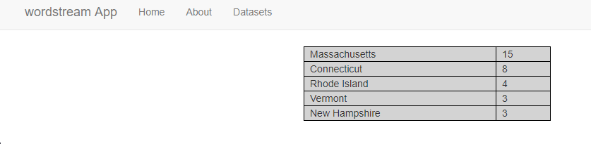

# wordstream App

wordstream App is an app that takes json data from wordstream and parses the geo_location data. 

## Installation

Use git to clone the repositry https://github.com/BartekJimenez/wordstreamApp.git

```bash
git clone https://github.com/BartekJimenez/wordstreamApp.git
```

## Setup

Make sure you have the following python packages:
- flask
- Flask-Assets
- requests

If you don't, install whatever you need via pip:

```bash

py -m pip install Flask-Assets
py -m pip install requests
py -m pip install flask
```

pip commands for non-windows machines:
```bash

pip install Flask-Assets
pip install requests
pip install flask
```

Please also make sure you are using Chrome or Firefox. Adblock may issues some complications with javascript, so if you notice the webapp isn't functioning properly you should try disabling that first.

## Usage

navigate to the root, and type in your console:
```python
py .\app.py

```
If your packages are all installed, you should be running the app. Get the url from the console, it should be : http://127.0.0.1:5000/

You will notice that there's a home page, and a few tabs. Pay attention to these two tabs:
- Datasets
- Home

In the tab 'Datasets' you can view the parsed data that was 'under' geo_locations. It also presents to you the data, and how you may want to use it. When you first click it, you will see 6 datasets, but if you click one(say 'regions') then you will see the data regions actually has.

Now if you click the 'Home' button again, you will return to the main screen and see a simple input widget. 

Some key things to note:
- If a dataset only has a single entity, e.g. countries only has one field then when you try to use that dataset you will be unable to edit the data and only can leave the 'skip' variables.
- If there are multiple fields in a dataset, then the key field is required. The Value field is optional, but leave it as skip if you aren't going to use it.
- If you type incorrect data, you will get an error and have to try again. 
- You cannot compare two or more of the same datasets against each other.
- If your request top amount is greater than results, you will get the amount of your results. E.g. you want top 9 but only 6 results exist, you will get 6. 

## Example 1

Let's try an example:


results in:


## Example 2

Let's compare three different data sets 


results in:


## Example 3 

Let's compare three different data sets, with two where clauses:


results in:


Take this example:


which gets its data from:


 For a loose SQL statement, it is similar to a query of select 'country' from regions where key = 3847, but in this application you don't need to specify the key. The app does it automatically.

 ## Conclusion

 I hope you enjoyed the app, please reach out if you have any questions! I tried to make an example app that can 'query' data from python objects stored in memory as opposed to traditional SQL databases. I think this was a fun exercise, and I hope you enjoyed reviewing my app!

